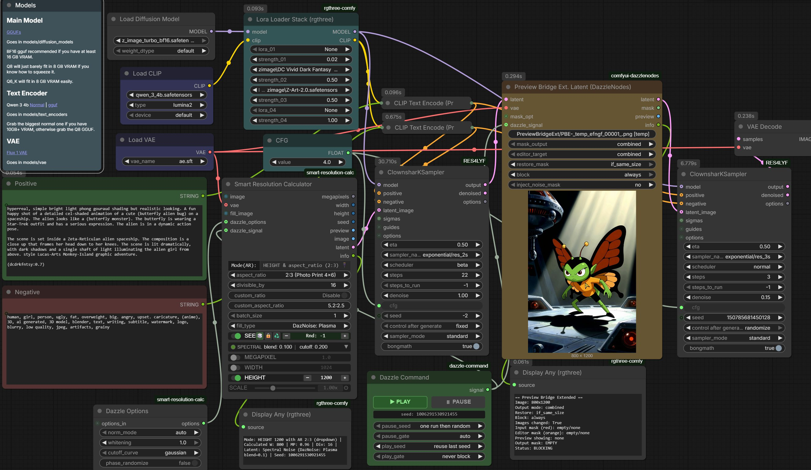

# ComfyUI Preview Bridge Extended

[](https://www.python.org/downloads/)
[](https://registry.comfy.org/publishers/djdarcy/nodes/comfyui-preview-bridge-extended)
[](https://github.com/DazzleNodes/ComfyUI-PreviewBridgeExtended/releases)
[](https://www.gnu.org/licenses/gpl-3.0)

Enhanced Preview Bridge with optional mask input, 3-layer mask editing, and workflow orchestration. Part of the [DazzleNodes](https://github.com/DazzleNodes/DazzleNodes) collection.

<p align="center">
  
</p>

## Nodes

### Preview Bridge Extended (DazzleNodes)
Accepts **IMAGE** input with optional MASK. Preview images, draw masks in MaskEditor, and control workflow execution with configurable blocking.

### Preview Bridge Ext. Latent (DazzleNodes)
Accepts **LATENT + VAE** input. VAE decodes for preview display while the original latent passes through unmodified. Extracts `noise_mask` from LATENT as upstream mask, with optional write-back via `inject_noise_mask`.

## Features

- **Optional Mask Input**: Accept masks from upstream nodes (LoadImage, SAM, detection nodes)
- **3-Layer Mask Editing**: Input mask (red), editor drawings (orange), subtractions (erased areas)
- **Configurable Output**: Choose between combined, input_mask, or mask_editor output modes
- **Instant Preview Refresh**: Preview updates immediately when changing display mode widgets
- **Mask Restoration**: Persist masks across image changes (never, always, if_same_size)
- **Smart Blocking**: Block execution based on mask state (never, if_empty_mask, if_empty_editor, always)
- **Latent Support**: Preview latents with VAE decode, edit noise masks, pass through unmodified
- **Dazzle Command Integration**: Optional DAZZLE_SIGNAL input for play/pause gate control. Multi-DazzleCommand workflows supported — each PBE reads its own connected DC's state
- **Cache-Compatible Previews**: Deterministic filenames prevent cache invalidation. Downstream nodes (KSampler, VAEEncode) correctly cache when PBE's input hasn't changed

## Installation

### ComfyUI Manager

Search for "Preview Bridge Extended" in ComfyUI Manager, or use the CLI:
```bash
comfy node registry-install comfyui-preview-bridge-extended
```

### DazzleNodes Collection (Recommended)

Included automatically in the [DazzleNodes](https://github.com/DazzleNodes/DazzleNodes) aggregate package (also available in ComfyUI Manager)

### Manual

```bash
cd ComfyUI/custom_nodes
git clone https://github.com/DazzleNodes/ComfyUI-PreviewBridgeExtended.git
```

## Quick Start

### IMAGE Workflow
1. Connect an IMAGE output to the node
2. Optionally connect a MASK to `mask_opt`
3. Open MaskEditor to draw/edit masks
4. Set `block` mode to control downstream execution

### LATENT Workflow
1. Connect LATENT + VAE to the node
2. The latent is decoded for preview only
3. Edit the noise mask in MaskEditor
4. Enable `inject_noise_mask` to write the mask back into LATENT output

### With Dazzle Command
Connect [Dazzle Command](https://github.com/DazzleNodes/ComfyUI-DazzleCommand) (v0.2.3+) signal output to the `dazzle_signal` input. Play/pause toggles control blocking behavior automatically. Multiple DazzleCommand + PBE pairs operate independently in the same workflow.

## Widget Reference

| Widget | Options | Default | Description |
|--------|---------|---------|-------------|
| mask_output | combined, input_mask, mask_editor | combined | What goes to the output MASK slot |
| editor_target | combined, mask_editor, input_mask | combined | Which layer MaskEditor affects |
| restore_mask | never, always, if_same_size | never | Mask restoration across image changes |
| block | never, if_empty_mask, if_empty_editor, always | never | Execution blocking mode |
| dazzle_signal | DAZZLE_SIGNAL | -- | Optional orchestration from Dazzle Command |
| inject_noise_mask | true, false | false | (Latent only) Write mask back to LATENT output |

## Background

This node extends the Preview Bridge concept from [ComfyUI-Impact-Pack](https://github.com/ltdrdata/ComfyUI-Impact-Pack). We've contributed fixes to the original via PRs ([#1172](https://github.com/ltdrdata/ComfyUI-Impact-Pack/pull/1172), [#1009](https://github.com/ltdrdata/ComfyUI-Impact-Pack/pull/1009)). Since Impact-Pack maintains a conservative approach, this standalone node enables rapid iteration on extended features.

## Technical Documentation

- [Architecture](docs/architecture.md) -- LayerCache system, mask combination, empty detection
- [Dazzle Command Integration](docs/dazzle-signal.md) -- DAZZLE_SIGNAL protocol, cache-transparent orchestration

## Troubleshooting

Enable verbose debug logging:
```bash
# Windows
set PBE_DEBUG=1 && python main.py

# Linux/Mac
PBE_DEBUG=1 python main.py
```

## Contributing

Contributions welcome! Fork, create a feature branch, test in ComfyUI, and submit a PR.

Like the project?

[](https://www.buymeacoffee.com/djdarcy)

## Acknowledgements

Part of the [DazzleNodes](https://github.com/DazzleNodes) collection.

Inspired by:
- [ComfyUI-Impact-Pack](https://github.com/ltdrdata/ComfyUI-Impact-Pack) Preview Bridge node
- [WAS Node Suite](https://github.com/WASasquatch/was-node-suite-comfyui) mask combination patterns

## License

This project is licensed under the GNU General Public License v3.0 - see the [LICENSE](LICENSE) file for details.